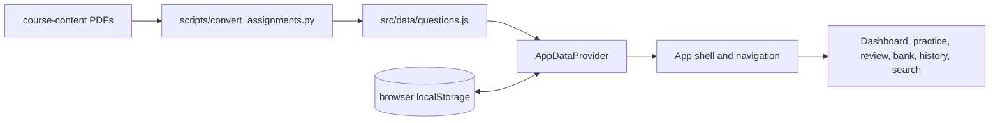

# Technical Design Document

## 1. Scope

This document describes the current technical design and the constraints for extending NPTEL Python Prep without breaking its local-first behavior.

## 2. Architecture

The application is a single-page React application served by Vite.

### Runtime layers

1. **Static content:** `src/data/questions.js` contains course weeks and questions generated from source PDFs.
2. **Application state:** `AppDataProvider` loads persisted state, enriches questions with week numbers, flattens the question bank, and exposes actions.
3. **Domain utilities:** `shuffle.js`, `stats.js`, and `storage.js` contain session construction, scoring-related statistics, and persistence.
4. **Presentation:** route-like view state in `App.jsx` selects React screens; components render the study experience.

## 3. Navigation Model

`App.jsx` uses a small in-memory route object rather than React Router. A route has a `view` and optional `params`. Navigation is performed through `NavContext` and resets scroll position.

Current views include `dashboard`, `week`, practice setup views, `practice`, `result`, `review`, `bank`, `weak`, `history`, and `search`.

This is sufficient for a static application. A future URL-addressable route system should preserve these view concepts and avoid coupling domain state to browser history until there is a clear need.

## 4. Practice Lifecycle

1. A setup screen receives a question pool and scope.
2. The learner selects count and optional exam timer.
3. The pool is shuffled; selected questions and options are copied into a session.
4. The practice view stores selected answers in component state.
5. Practice mode may mark the current question checked; exam mode keeps feedback hidden.
6. Submission computes each question's correctness and counts correct, wrong, and unattempted answers.
7. `recordAttempt` creates an attempt ID and timestamp, appends history, and applies answers to question statistics.
8. The result view receives the in-memory attempt and session, then offers review or retry.
9. The provider effect persists the updated state to `localStorage`.

## 5. Scoring and Statistics

Question correctness is based on exact set equality between selected answers and `correctAnswers`, which supports both MCQ and MSQ. Attempt accuracy is `correct / (correct + wrong)` rounded to a whole percentage; unattempted items are excluded from the denominator.

Question status is derived from `{ attempts, correct, wrong }`, not stored as a second source of truth. Keep this property when changing thresholds.

## 6. Error and Edge-Case Handling

- Malformed or absent storage falls back to default state.
- Empty pools disable session start and can show an explanation.
- A timed session submits once when the timer reaches zero.
- Repeated submission is prevented by a ref guard.
- Empty answers are recorded as unattempted.
- A missing question stat is treated as new.
- Storage write failures are logged and do not crash rendering.

## 7. Extensibility Constraints

- Keep content data separate from runtime progress.
- Do not mutate `rawWeeks` or source question objects while shuffling.
- Add new persisted fields with backward-compatible defaults in `loadState`.
- Keep scoring and status rules in pure utilities so they can be unit tested.
- Use stable question IDs; changing an ID resets that question's historical continuity.
- If remote persistence is introduced, preserve the provider-facing API and add synchronization beneath it.

## 8. Quality Attributes

- **Privacy:** no network submission of learner progress in the current product.
- **Performance:** question pools are small enough for in-memory flattening and client-side search.
- **Accessibility:** semantic controls, keyboard operation, contrast-checked status colors, and reduced-motion support.
- **Resilience:** reloads restore theme, history, and question statistics when storage is available.
- **Maintainability:** pure domain utilities, focused components, and generated content pipeline.

## 9. Technical Risks

- Browser storage can be cleared, blocked, or quota-limited.
- The README currently names a different storage key than the implementation; documentation and migration behavior must be aligned.
- Generated question content may drift from source PDFs without a repeatable validation step.
- In-memory route state loses the current screen on a full reload.
- Long histories may eventually require export, pruning, or indexed storage.
