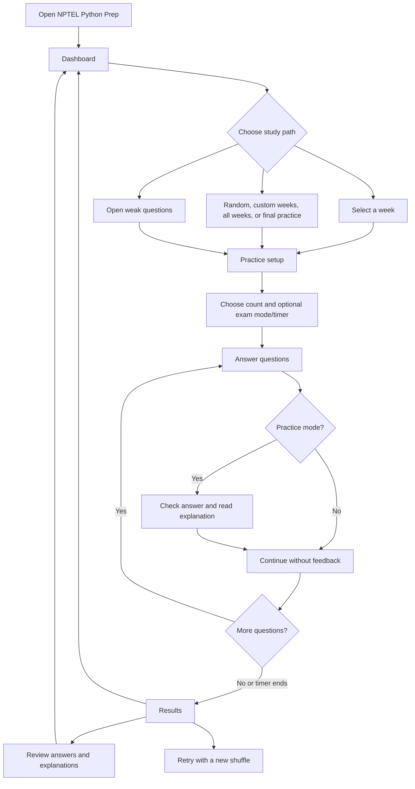

# User Flow

## 1. Primary Study Flow

## 2. Supporting Flows

### Week exploration

Dashboard -> Week -> inspect status and question list -> start full practice -> results -> review -> return to week or dashboard.

### Weak-question remediation

Dashboard or sidebar -> Weak questions -> inspect mistake counts -> start weak-question practice -> complete attempt -> statistics update -> weak list changes when thresholds change.

### Search

Topbar search -> enter query -> matching questions across prompt, options, and week labels -> open question context or begin relevant practice.

### History

Sidebar -> History -> scan date, scope, mode, score, and accuracy -> open an attempt's result/review context where supported.

### Theme

Topbar -> toggle light/dark -> document root class changes -> all theme-aware components update -> theme persists in local storage.

## 3. Key States

- Empty learner: no attempts, all questions new, dashboard should recommend starting a week or random practice.
- Active practice: progress indicator, current question, selected answers, and optional timer.
- Exam mode: no immediate correctness feedback; answered count remains visible; timer may auto-submit.
- Completed attempt: score breakdown, accuracy, duration, retry, review, and dashboard actions.
- No weak questions: explain that weak status requires at least two wrong answers and below 50% accuracy.
- Storage unavailable: continue the session in memory and make persistence failure visible through an existing error pattern in a future UI pass.

## 4. Interaction Rules

- MCQ allows one selected option.
- MSQ allows multiple selected options.
- Practice mode prevents changing an answer after it is checked.
- Exam mode allows answer changes until submission.
- A blank question counts as unattempted.
- Question and option order may change between sessions.
- A completed attempt is the only event that updates durable statistics.
